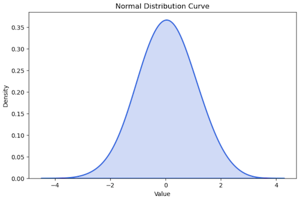
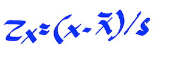

# Statistical Thinking in Data Science

## Statistics

### Overview

Statistics forms the foundation of data science, equipping practitioners with mathematical tools to collect, analyze, interpret, and present data. These tools enable data scientists to extract insights, make predictions, and support decision-making through data-driven approaches.

### Key Concepts

1. **Descriptive Statistics**: Summarizes and explores the main characteristics of datasets.

   - Data summarization
   - Measures of central tendency (mean, median, mode)
   - Measures of variability (range, variance, standard deviation)

2. **Inferential Statistics**: Facilitates predictions or generalizations about populations based on sample data.
   - Drawing inferences from samples
   - Hypothesis testing
   - Confidence intervals
   - Regression analysis and correlation

## Data

### Data Types

Data can be classified as:

- **Nominal**: Categorical data without inherent order (e.g., colors, names, gender).
- **Ordinal**: Categorical data with a defined order but unequal intervals (e.g., rankings, ratings).
- **Interval**: Numerical data with equal intervals but no true zero (e.g., temperature).
- **Ratio**: Numerical data with equal intervals and a true zero (e.g., height, weight).

### Key Terms

1. **Population**: The complete set of individuals or items of interest.

2. **Sample**: A subset of the population selected for analysis.

3. **Distribution**: Describes how values are spread within a dataset.

   

   

4. **Central Tendency**: Represents the center or typical value of a dataset.

   - **Mean** (μ): The average value.

     - **Population Mean**:

       

       where:

       - Σ = sum of all values in the population
       - Xi = each value in the population
       - N = total number of values

     - **Sample Mean** (x-bar):

       

       where:

       - Σ = sum of all values in the sample
       - Xi = each value in the sample
       - n = total number of values

   - **Median**: The middle value in an ordered dataset.

     | Students   | 1   | 2   | 3   | 4   | 5   | 6                                                          | 7   | 8   | 9   | 10  | 11  |
     | ---------- | --- | --- | --- | --- | --- | ---------------------------------------------------------- | --- | --- | --- | --- | --- |
     | **Grades** | 72  | 75  | 78  | 80  | 82  | 85 | 88  | 90  | 92  | 94  | 96  |

     - The **median** is **85** (the 6th value).

   - **Mode**: The value(s) that occur most frequently.

     | Students   | 1   | 2   | 3   | 4   | 5                                                          | 6                                                          | 7   | 8   | 9   | 10  | 11  |
     | ---------- | --- | --- | --- | --- | ---------------------------------------------------------- | ---------------------------------------------------------- | --- | --- | --- | --- | --- |
     | **Grades** | 72  | 75  | 78  | 80  | 82 | 82 | 85  | 88  | 90  | 92  | 94  |

     - The **mode** is **82** (appears twice).

5. **Standard Deviation**: Measures the spread of data around the mean.

   - Low standard deviation: values are close to the mean.
   - High standard deviation: values are more dispersed.

   - **Population Standard Deviation**:

     

     where:

     - Σ = sum of squared deviations from the mean
     - Xi = each value in the population
     - μ = population mean
     - N = total number of values

   - **Sample Standard Deviation**:

     

     where:

     - Σ = sum of squared deviations from the mean
     - Xi = each value in the sample
     - μ = sample mean
     - n = total number of values

   #### Empirical Rule

   The **Empirical Rule** (68-95-99.7 Rule) for normal distributions states:

   - **68%** of data falls within **1 standard deviation**
   - **95%** within **2 standard deviations**
   - **99.7%** within **3 standard deviations**

   

   This rule helps estimate data spread and identify outliers.

6. **Variance**: The average squared deviation from the mean.

   - Low variance: values are close to the mean.
   - High variance: values are more spread out.

   - **Population Variance**:

     

     where:

     - Σ = sum of squared deviations from the mean
     - Xi = each value in the population
     - μ = population mean
     - N = total number of values

   - **Sample Variance**:

     

     where:

     - Σ = sum of squared deviations from the mean
     - Xi = each value in the sample
     - μ = sample mean
     - n = total number of values

7. **Z-Score**: Indicates how many standard deviations a value is from the mean.

   - Z = 0: at the mean
   - Z > 0: above the mean
   - Z < 0: below the mean

   - **Population Z-Score**:

     

     where:

     - X = each value in the population
     - μ = population mean
     - N = total number of values in population

   - **Sample Z-Score**:

     

     where:

     - X = each value in the sample
     - μ = sample mean
     - s = total number of values in sample

8. **Covariance**: Measures how two variables change together (direction, not strength).

   - Positive: variables increase together.
   - Negative: one increases as the other decreases.

   - **Population Covariance**:

     

     where:

     - Σ = sum of products of deviations from the mean
     - Xi = each value in the population
     - x-bar = population mean
     - n = total number of values in population

   - **Sample Covariance**:

     

     where:

     - Σ = sum of products of deviations from the mean
     - Xi = each value in the sample
     - x-bar = sample mean
     - n = total number of values in sample

9. **Correlation**: Quantifies the strength and direction of a linear relationship.

   - Positive: variables increase together.
   - Negative: one increases as the other decreases.
   - Zero: no linear relationship.

   - **Pearson r Formula**:

     
